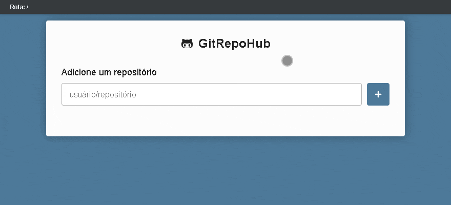

# GitRepoHub

Aplicação Front-End responsiva com ReactJS que consome REST API do GitHub. A aplicação adiciona, lista e exibe detalhes de cada repositório. Nos detalhes é possível ver as Issues organizadas por filtro e por página.

Passo a passo documentado em: [https://github.com/cafecomlucas/GitRepoHub/blob/master/\_steps.md](https://github.com/cafecomlucas/GitRepoHub/blob/master/_steps.md)



---

## Como iniciar

### Versão online

Acesse o endereço [gitrepohub.herokuapp.com](https://gitrepohub.herokuapp.com/)

### Localmente

Clone este repositório, acesse o diretório, instale as dependências e inicie a aplicação:

```bash
git clone https://github.com/cafecomlucas/GitRepoHub.git
cd GitRepoHub/
yarn
yarn dev
```

---

### Funcionalidades

- Configuração do padrão de código (com EditorConfig, ESLint e Prettier);
- Roteamento no Front-End através do React Router DOM;
- Configuração das rotas `/` e `/repository`;
- Estilização escopada com Styled Components;
- Responsividade e utilização do Flexbox;
- Busca de dados em API externa através de requisições assíncronas;
- Adição e listagem de repositórios no componente `Main` (rota `/`);
- Captura de possíveis erros através do `try/catch` no componente `Main`;
- Validação de dado no campo de adicionar repositório (se vazio, inexistente ou duplicado) e estilização do input em caso de erro;
- Animação do ícone de carregamento até a conclusão da chamada a API;
- Armazenamento local para os dados continuarem aparecendo após o recarregamento da página;
- Exibição de dos detalhes e das Issues de cada repositório no componente `Repository` (rota `/repository/:repository`);
- Filtro na listagem de Issues. Cada opção do filtro permite exibir apenas Issues abertas, apenas Issues fechadas ou todas as Issues.
- Paginação das Issues listadas;
- Botões de página seguinte e página anterior. O botão de página anterior fica desativado na primeira página.
